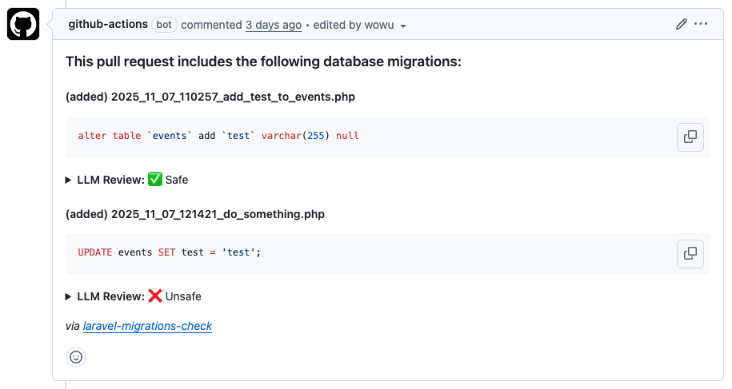

# Laravel Migrations Check GitHub Action

GitHub Action to list Laravel migrations modified in Pull Requests as a comment and optionally review them with ChatGPT.



## Usage

Required permissions:

```yml
permissions:
  contents: write
  pull-requests: write
```

Job parameters:

```yml
- uses: mtwteam/laravel-migrations-check@v1
  with:
    # GitHub Token used to add comments to PRs.
    # Default: ${{ github.token }}
    github_token: ""

    # OpenAI Token used for automatic review. Not required.
    # Default: ""
    openai_token: ""

    # Additional context about the project, for example database engine version, list of big tables, etc.
    # Default: ""
    context: ""
```

## Full example

```yml
on:
  pull_request:

permissions:
  contents: write
  pull-requests: write

jobs:
  migrations:
    runs-on: ubuntu-latest
    steps:
      - uses: actions/checkout@v5
      - uses: shivammathur/setup-php@v2
        with:
          php-version: "8.4"
      - name: Install Composer dependencies
        run: composer install
      - uses: mtwteam/laravel-migrations-check@v1
        with:
          openai_token: ${{ secrets.OPENAI_API_KEY }}
          context: |
            We use MySQL 8.4, big tables are: events, orders.
```

## Scenarios

### Just add a comment with a list of new migrations

```yml
- uses: mtwteam/laravel-migrations-check@v1
```

### Review new migrations with ChatGPT

```yml
- uses: mtwteam/laravel-migrations-check@v1
  with:
    openai_token: ${{ secrets.OPENAI_TOKEN }}
    context: We use MySQL 8.4, big tables are: events, orders.
```
